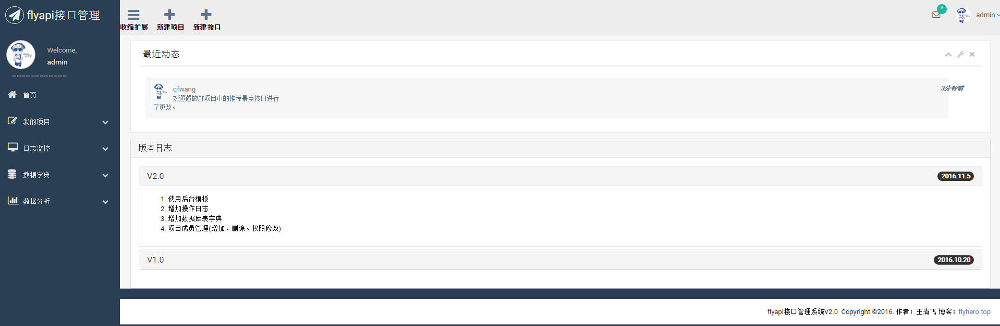
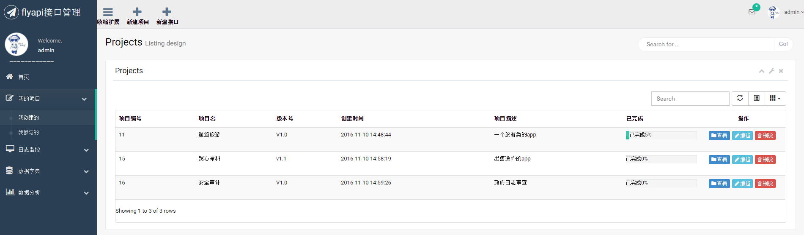

# flyapi2.0
开发中不必再麻烦的写文档，前后端人员联调会更加方便，通过在线接口管理，前端人员很容易知道后端人员增加、修改了哪些接口，大大减少了联调时间和增加了工作效率。
项目成员可将项目中的接口生成pdf文档，方便保存。

# 项目地址
Github: https://github.com/flyhero/flyapi2.0

码云：http://git.oschina.net/flyhero/flyapi2.0

# 技术选择
1、后端

- 核心框架：Spring Framework 4.1.7
- 视图框架：Spring MVC 4.1.7
- 持久层框架：MyBatis 3.2.6
- 任务调度：Spring + Quartz 2.2.2
- 分页插件：Mybatis-PageHelper 4.0.0
- 数据库：MySql 5.6
- 数据库连接池：Alibaba Druid 1.0.9
- 日志管理：SLF4J 1.7.7、Log4j
- 即时消息：Spring WebSocket

2、前端

- JS框架：jQuery 1.9
- CSS框架：Twitter Bootstrap 3.3.1
- 客户端验证：Bootstrap-Validator
- 数据表格：Bootstrap-table
- 日期控件： My97DatePicker
- 弹层组件：layer2.4
- 数据可视化：echarts 3
- markdown编辑器: editor.md

# 演示界面
## 登录页面

## 主页面

## 项目列表

## 即时消息
